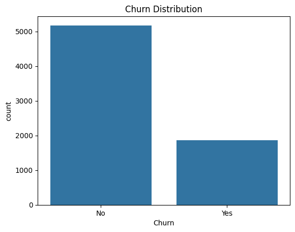
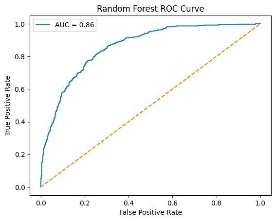
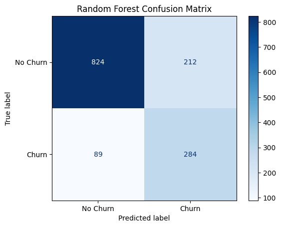
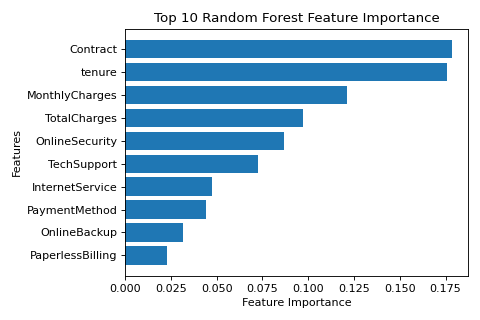

# 📊 Customer Churn Prediction – Final Wrap-Up

This project demonstrates an **end-to-end data science workflow** for predicting customer churn, from data exploration to model deployment. It includes a **final notebook** summarizing all steps in a structured, professional way.

---

## 📓 Final Notebook Overview

The notebook `churn_prediction_final.ipynb` includes the following sections:

### 1. Intro
- **Problem statement:** Predicting which customers are likely to churn.  
- **Business impact:** Retaining customers reduces revenue loss and improves profitability.

### 2. Dataset Overview
- Description of the dataset features.  
- Number of samples, target variable distribution (`Churn`).  
- Basic statistics and summary.

### 3. Exploratory Data Analysis (EDA)
- Visualizations for categorical and numerical features.  
- Churn rate analysis across different customer segments.  
- Correlation analysis and insights from data patterns.

**Churn Distribution:**

### 4. Preprocessing
- Handling missing values and outliers.  
- Encoding categorical variables.  
- Scaling numerical features if necessary.  
- Train-test split for model evaluation.

### 5. Random Forest
- Model training and evaluation.  
- Metrics: Accuracy, Precision, Recall, F1-score, ROC-AUC.  
- ROC curve visualization:

### 6. Model Comparison

| Model         | Accuracy | Precision | Recall | F1-score | ROC-AUC |
| ------------- | -------- | --------- | ------ | -------- | ------- |
| Random Forest | 0.72     | 0.49      | 0.83   | 0.61     | 0.78    |

**Confusion Matrix (Random Forest):**

### 7. Feature Importance
- Plot feature importances from Random Forest.  
- Highlight key drivers of churn (e.g., tenure, contract type, monthly charges):

### 8. Conclusion
- **Best performing model:** Random Forest for identifying high-risk churners.  
- **Key business insights:** Customers with low tenure and certain service features are more likely to churn.  
- **Recommendations:** Targeted retention campaigns, personalized offers, and feature-specific interventions.

---